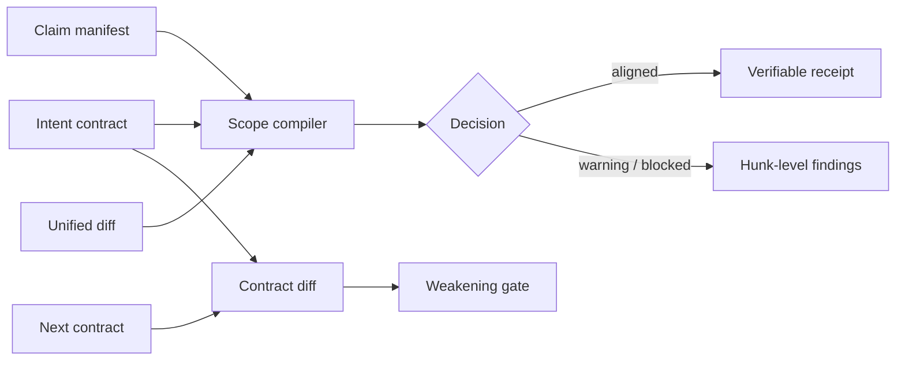

# ScopeWitness

**A deterministic diff-accountability compiler for AI-generated code changes.**

Tests can prove that code runs. They cannot prove that every changed line was
requested. ScopeWitness closes that gap by compiling an intent contract, an
agent-authored claim manifest, and a unified diff into an auditable decision.

It answers five practical questions:

1. Is every diff hunk tied to a requested outcome?
2. Did the patch stay inside its allowed paths and size budget?
3. Did source changes include corresponding tests?
4. Did the patch touch dependencies, workflows, or protected files without
   explicit authorization?
5. Was the contract weakened before the patch was evaluated?

ScopeWitness is local-first, dependency-light, and deterministic. It does not
send code to a model or external service.

## Why this exists

Coding agents can produce correct-looking patches while exceeding the user's
actual request. Existing linters, tests, and policy engines usually inspect
code quality or repository-wide rules; they do not require each hunk to account
for itself against the current task.

ScopeWitness treats scope as a build artifact:



## Controls

- Hunk-level accountability with stable content-derived IDs
- Allowed and forbidden path boundaries
- File-count and changed-line budgets
- Source-to-test coupling
- Dependency and workflow change gates
- Approval requirements for protected paths
- Outcome-specific paths, change kinds, and required diff tokens
- Catch-all claim rejection
- Contract weakening detection
- Tamper-evident scope receipts
- Human-readable CLI output and a browser-based inspection studio

## Quick start

Requirements: Node.js 20+ and pnpm 10.14+.

```bash
pnpm install
pnpm check

# Inspect a diff without a contract
pnpm scope inventory examples/aligned.diff

# Compile a scope decision
pnpm scope audit examples/contract.json \
  --patch examples/aligned.diff \
  --claims examples/claims.json \
  --at 2026-07-29T06:30:00.000Z

# See the intentionally blocked example
pnpm scope audit examples/contract.json \
  --patch examples/scope-creep.diff \
  --claims examples/claims.json
```

The aligned example returns exit code `0`. A blocked audit returns `2`, so the
same command can be used directly as a CI gate.

## CLI

```text
scope-witness inventory <patch.diff> [--json]
scope-witness audit <contract.json> --patch <patch.diff> --claims <claims.json>
scope-witness explain <contract.json> --patch <patch.diff> --claims <claims.json> --hunk <id>
scope-witness receipt <contract.json> --patch <patch.diff> --claims <claims.json> --output <receipt.json>
scope-witness verify <receipt.json> [--contract <json>] [--claims <json>] [--patch <diff>]
scope-witness diff <previous.json> <next.json> [--json]
scope-witness init [directory]
```

Exit codes are stable: `0` aligned/valid, `2` blocked, `3` warning,
`4` weakened contract, and `5` invalid input.

To audit the staged work in another repository:

```bash
git diff --cached --binary > .scope-witness/changes.diff
scope-witness audit .scope-witness/contract.json \
  --patch .scope-witness/changes.diff \
  --claims .scope-witness/claims.json
```

See [Contract reference](docs/CONTRACT.md),
[Claim manifest reference](docs/CLAIMS.md), and
[CI integration](docs/INTEGRATION.md).

## Scope Studio

```bash
pnpm dev
```

The studio includes aligned and scope-creep scenarios, an editable diff,
hunk-to-outcome mapping, findings, and downloadable receipts. The entire
analysis runs in the browser.

## Contract weakening

Scope policy is itself a security boundary. Compare the approved version with a
proposed version before using the latter:

```bash
pnpm scope diff examples/contract.json examples/weakened-contract.json
```

ScopeWitness flags expanded path access, higher budgets, removed forbidden
paths or approvals, relaxed test/dependency/workflow gates, catch-all claims,
removed outcomes, and broader change kinds.

## Design boundary

ScopeWitness verifies structural accountability, not the truth of a natural
language claim. An agent could provide a plausible but dishonest reason.
Protected approvals must therefore come from a trusted workflow, and high-risk
changes still require human review. Read the full
[threat model](docs/THREAT-MODEL.md).

The project was motivated by current research on coding-agent misalignment,
unnecessary edits, and patch traceability:

- [How Coding Agents Fail Their Users](https://arxiv.org/abs/2605.29442)
- [TRIM: Reducing AI-Generated CodeSlop via Agent Trajectory Minimization](https://arxiv.org/abs/2607.18161)
- [Understanding Automated Program Repair Agents through the Lens of Traceability](https://research.ibm.com/publications/understanding-automated-program-repair-agents-through-the-lens-of-traceability-an-empirical-study)

## Repository layout

```text
packages/core    parser, compiler, receipt verification, contract diff
packages/cli     command-line interface
apps/studio      interactive browser inspector
examples         aligned and adversarial fixtures
docs             contracts, claims, integrations, and threat model
```

## Contributing and security

Contributions are welcome through [CONTRIBUTING.md](CONTRIBUTING.md). Please
report vulnerabilities according to [SECURITY.md](SECURITY.md).

## License

[MIT](LICENSE)
